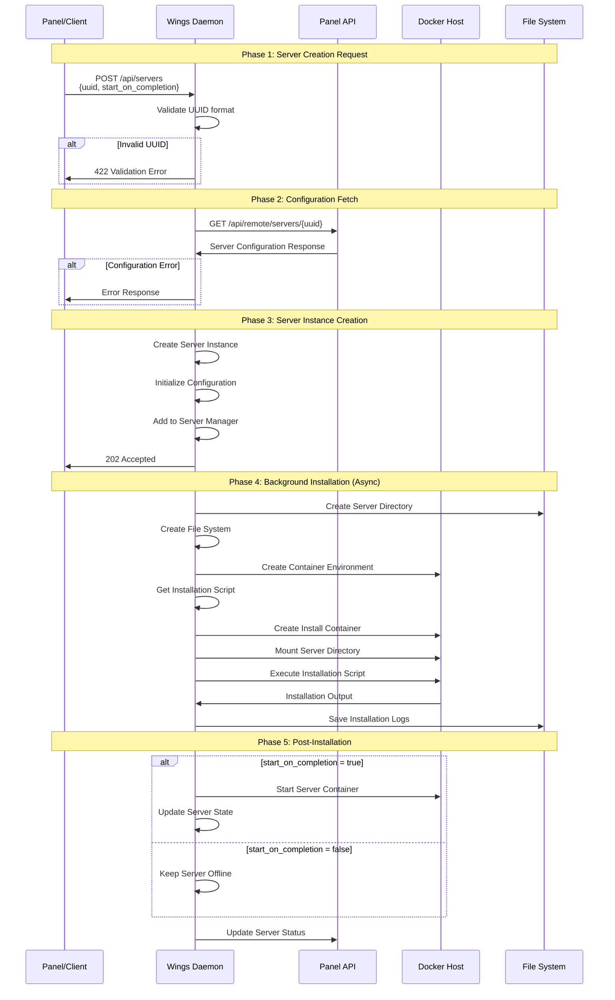

# Wings Server Creation Flow Diagram

## Overview
This document illustrates the complete flow of how servers are created in Wings, from API request to fully functional server instance.

## Architecture Components

```
┌─────────────────┐    ┌─────────────────┐    ┌─────────────────┐
│   Panel/Client  │    │   Wings Daemon  │    │   Docker Host   │
│                 │    │                 │    │                 │
│ • Web Interface │    │ • API Server    │    │ • Containers    │
│ • API Client    │    │ • Server Mgmt   │    │ • Volumes       │
│ • Database      │    │ • File System   │    │ • Networks      │
└─────────────────┘    └─────────────────┘    └─────────────────┘
```

## Server Creation Flow



## Detailed Component Flow

### 1. API Request Processing
```
┌─────────────────────────────────────────────────────────────┐
│                    Wings API Layer                         │
├─────────────────────────────────────────────────────────────┤
│ 1. Receive POST /api/servers                              │
│ 2. Validate Authorization Token                            │
│ 3. Parse Request Body (ServerDetails)                     │
│ 4. Extract Manager from Context                           │
└─────────────────────────────────────────────────────────────┘
```

### 2. Server Details Structure
```json
{
  "uuid": "550e8400-e29b-41d4-a716-446655440000",
  "start_on_completion": false
}
```

### 3. Configuration Fetch Process
```
┌─────────────────────────────────────────────────────────────┐
│                  Panel Communication                       │
├─────────────────────────────────────────────────────────────┤
│ 1. Create HTTP Client with Auth Token                     │
│ 2. GET /api/remote/servers/{uuid}                        │
│ 3. Parse ServerConfigurationResponse                      │
│ 4. Extract Settings & ProcessConfiguration               │
└─────────────────────────────────────────────────────────────┘
```

### 4. Server Instance Creation
```
┌─────────────────────────────────────────────────────────────┐
│                  Server Manager                            │
├─────────────────────────────────────────────────────────────┤
│ 1. Create New Server Instance                             │
│ 2. Sync Configuration with Panel Data                     │
│ 3. Initialize File System                                 │
│ 4. Setup Docker Environment                               │
│ 5. Add to Server Collection                               │
└─────────────────────────────────────────────────────────────┘
```

### 5. Installation Process
```
┌─────────────────────────────────────────────────────────────┐
│                  Installation Flow                         │
├─────────────────────────────────────────────────────────────┤
│ 1. Create Installation Process                            │
│ 2. Generate Installation Script                           │
│ 3. Create Temporary Directory                             │
│ 4. Setup Docker Container                                 │
│ 5. Mount Server Directory                                 │
│ 6. Execute Installation Script                            │
│ 7. Stream Output to Logs                                 │
│ 8. Cleanup Temporary Files                               │
└─────────────────────────────────────────────────────────────┘
```

## File System Structure

```
/var/lib/pelican/
├── servers/
│   └── {server-uuid}/
│       ├── data/                    # Server data directory
│       ├── logs/                    # Server logs
│       ├── install.log              # Installation logs
│       └── config.yml              # Server configuration
├── install/
│   └── {server-uuid}.log           # Installation logs
└── wings.log                       # Wings daemon logs
```

## Docker Container Lifecycle

### Installation Container
```
┌─────────────────────────────────────────────────────────────┐
│                Installation Container                      │
├─────────────────────────────────────────────────────────────┤
│ Image: {container_image}                                  │
│ Entrypoint: {entrypoint}                                  │
│ Command: /mnt/install/install.sh                         │
│ Mounts:                                                   │
│   - /mnt/server → /var/lib/pelican/servers/{uuid}/data  │
│   - /mnt/install → /tmp/install_{uuid}                  │
│ Environment: Server environment variables                 │
└─────────────────────────────────────────────────────────────┘
```

### Server Container (Post-Installation)
```
┌─────────────────────────────────────────────────────────────┐
│                   Server Container                        │
├─────────────────────────────────────────────────────────────┤
│ Image: {server_image}                                     │
│ Command: {invocation}                                     │
│ Mounts:                                                   │
│   - /home/container → /var/lib/pelican/servers/{uuid}/data │
│ Environment: Server environment variables                 │
│ Resources: CPU, Memory, Disk limits                      │
└─────────────────────────────────────────────────────────────┘
```

## Error Handling Flow

```
┌─────────────────────────────────────────────────────────────┐
│                    Error Handling                         │
├─────────────────────────────────────────────────────────────┤
│ 1. Validation Errors → 422 Unprocessable Entity          │
│ 2. Auth Errors → 401/403 Unauthorized/Forbidden          │
│ 3. Panel Errors → Log and Return Error Response          │
│ 4. Installation Errors → Log and Notify Panel            │
│ 5. Docker Errors → Log and Cleanup Resources             │
└─────────────────────────────────────────────────────────────┘
```

## State Transitions

```
┌─────────────┐    ┌─────────────┐    ┌─────────────┐
│   Created   │───▶│ Installing  │───▶│   Offline   │
└─────────────┘    └─────────────┘    └─────────────┘
       │                   │                   │
       │                   ▼                   │
       │            ┌─────────────┐            │
       │            │   Failed    │            │
       │            └─────────────┘            │
       │                   │                   │
       ▼                   ▼                   ▼
┌─────────────┐    ┌─────────────┐    ┌─────────────┐
│   Online    │    │   Online    │    │   Online    │
└─────────────┘    └─────────────┘    └─────────────┘
```

## API Endpoints Used

### Wings → Panel Communication
- `GET /api/remote/servers/{uuid}` - Fetch server configuration
- `GET /api/remote/servers/{uuid}/install` - Get installation script
- `POST /api/remote/servers/{uuid}/install` - Update installation status
- `POST /api/remote/servers/{uuid}/container/status` - Update server state

### Client → Wings Communication
- `POST /api/servers` - Create server
- `GET /api/servers` - List servers
- `GET /api/servers/{uuid}` - Get server details
- `POST /api/servers/{uuid}/install` - Manual installation
- `GET /api/servers/{uuid}/install-logs` - Get installation logs

## Configuration Data Flow

```
Panel Database → Panel API → Wings → Server Instance
     │              │         │           │
     ▼              ▼         ▼           ▼
Server Config → HTTP Response → Parse → Apply to Server
```

## Security Considerations

1. **Authentication**: All requests require valid Bearer token
2. **Authorization**: Token must have appropriate permissions
3. **Isolation**: Each server runs in its own Docker container
4. **File Permissions**: Server directories have restricted access
5. **Network Isolation**: Containers use isolated network namespaces

## Monitoring and Logging

- **Installation Logs**: Stored in `/var/lib/pelican/install/{uuid}.log`
- **Server Logs**: Stored in server's data directory
- **Wings Logs**: Stored in `/var/lib/pelican/wings.log`
- **Docker Logs**: Available via `docker logs {container_id}`

## Performance Considerations

- **Async Processing**: Installation runs in background
- **Resource Limits**: Docker containers have CPU/Memory limits
- **Disk Space**: Servers have disk space quotas
- **Concurrent Installations**: Multiple servers can install simultaneously
- **Timeout Handling**: Installation processes have timeouts 